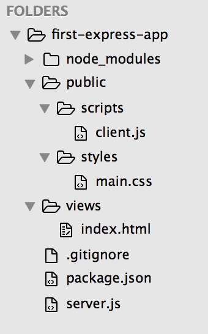
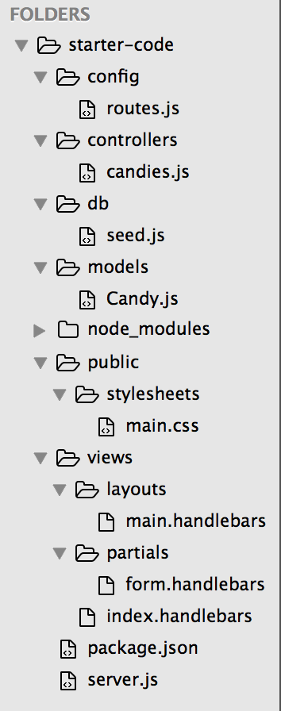
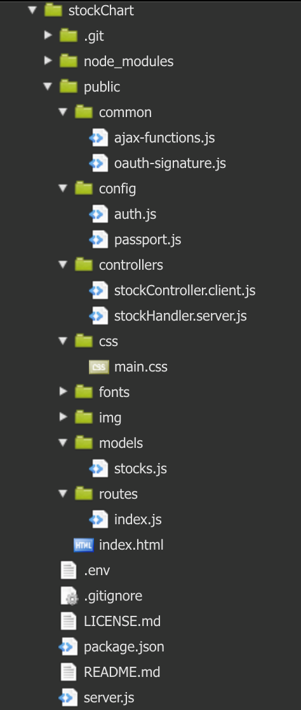

# fullStack-JS-review

##Objectives:

*By the end of this review, developers should be able to:*
- **Understand** the roles that Node, Express, Mongo, and Mongoose can play in a full-stack JS app
- **Organize** files in a full-stack JS app
- **Differentiate** between HTML, templates, Mongo, and JS by syntax clues
- **Define** "route" and "REST"
- **Parse** params, queries, and bodies from requests
- **Understand** why OOP is a useful paradigm to adopt in many circumstances

##The Main Pieces of a *Typical* Full-Stack Javascript App
| Tool  | Description  |
|---|---|
| Node  | Back-end/Server-side JS Library  |
| Express  | Node Library for Route Handling  |
| Mongo  | NoSQL DB that Saves Object-like "Documents"  |
| Mongoose  | Node Library for Mongo  |


##The Main Concepts in a *Typical* Full-Stack Javascript App
| Concept  | Description  |
|---|---|
| Routes  | A Way to Handle Requests and Responses with Paths and Actions  |
| REST  | An Architectural Style Based around "State Transfer" |
| Schema  | A "Skeleton" for Data Objects  |
| Model  | A "Body" for Data Objects (Schema with Functions)  |
| View  | User-facing Display  |
| Controller  | Website Functionality  |

##*Typical* Full-Stack JS Folder Structures







Now let's take a look at these files in one of our previous projects.

To summarize, here are the things you'll usually see in each part of the MVC architecture

| Location  | Description  |
|---|---|
| Model  | Mongo, Mongoose, schemas, models, Javascript  |
| View  | Express (render), HTML, Handlebars, templates, layouts, views, Javascript |
| Controller  | Node, Express (callback), controllers, **Javascript**  |

##What Is a Route?

- A **route** is a redirection to a specific resource with a specific action to execute on that resource.
- A **route** is the combination of a path (resource) and an action (GET/POST/PUT/DELETE).

##What Is REST?

- REST stands for "Representational State Transfer"
- A RESTful architecture must satisfy the following constraints:
  - **Client-Server**: Separates client (front-end) and server (back-end) logic
  - **Stateless**: No client context should be stored on the server until transaction is finalized, rather it should be passed from one service to another with requests and responses
  - **Cacheable**: State should be cacheable so we don't have to reload data on every transaction
  - **Layered System**: A client context should not be able to tell whether it is connecting to the server or an intermediary
  - **Uniform Interface**: All transactions should share a mutually understandable transcation format

##```npm init``` vs ```npm install```
- ```npm init``` creates a ```package.json``` file with thinks like "author" and "version", but most importantly, "dependencies"
- ```npm install``` actually installs those "dependencies" in the ```node_modules``` directory
- ```npm install packageName``` installs ```packageName``` in the ```node_modules``` directory
- ```npm install --save packageName``` installs ```packageName``` in the ```node_modules``` directory AND saves it in the "dependencies" in your ```package.json`` file

##Parts of a Request and Parsing Them
- The idea behind req.params, req.query, and req.body (especially with BodyParser) is to take URLs and HTTP payloads and convert them into an easily readable Javascript form.
- Since we're in Javascript, we are usually looking for JSON.
- req.params reference a simple part of the path like /api/todos/**:id**
- req.query references a part of the path after a query indicator (?) like /api/search/**?=stringToFind**
- req.body is the "payload" of data that is coming from the user
  - Usually the thing to "create" with POST
  - Usually the thing to "update" with PUT
  - Usually the thing to "delete" with DELETE

##Why OOP?


##Postman Demo

##Further Resources
[More on REST](https://en.wikipedia.org/wiki/Representational_state_transfer#Architectural_constraints)

## Licensing
All content is licensed under a CC­BY­NC­SA 4.0 license.
All software code is licensed under GNU GPLv3. For commercial use or alternative licensing, please contact legal@ga.co.
